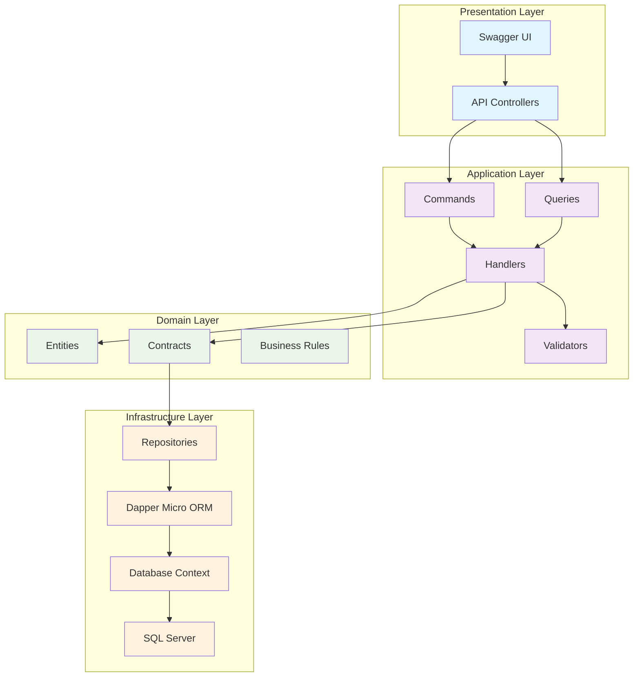
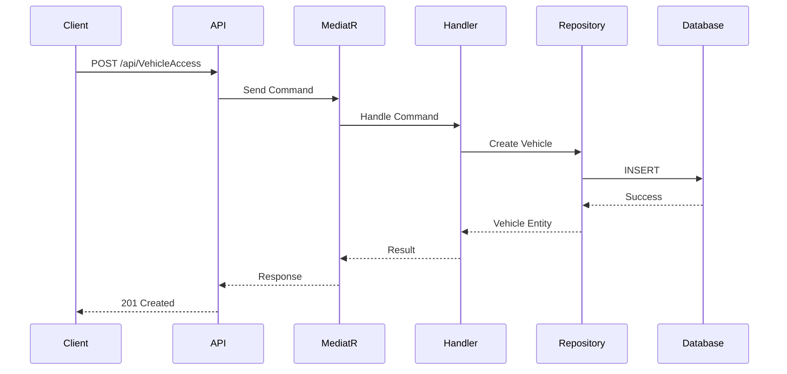
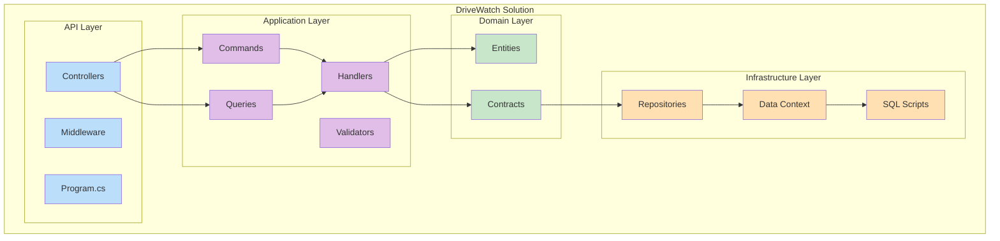
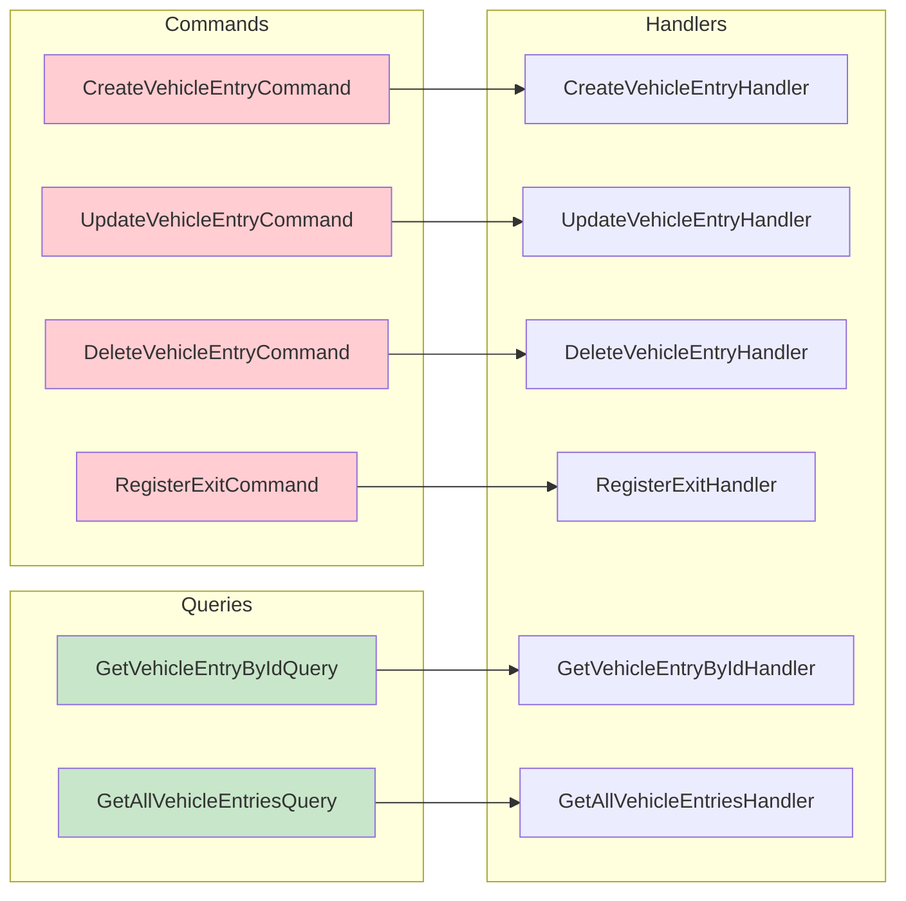
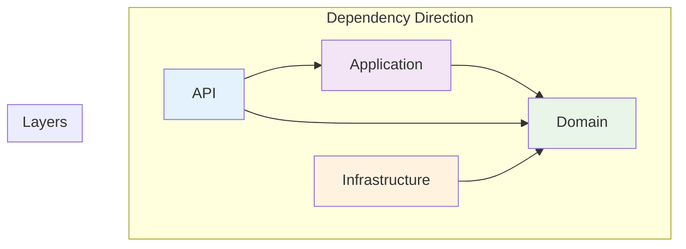

# 🚗 DriveWatch - Sistema de Controle de Acesso de Veículos

[](https://dotnet.microsoft.com/download/dotnet/8.0)
[](LICENSE)
[]()

## 📋 Índice

- [Visão Geral](#visão-geral)
- [Funcionalidades](#funcionalidades)
- [Arquitetura](#arquitetura)
- [Tecnologias Utilizadas](#tecnologias-utilizadas)
- [Instalação e Configuração](#instalação-e-configuração)
- [Como Usar](#como-usar)
- [API Endpoints](#api-endpoints)
- [Estrutura do Projeto](#estrutura-do-projeto)
- [Contribuição](#contribuição)
- [Licença](#licença)

## 🎯 Visão Geral

O **DriveWatch** é um sistema completo de controle de acesso de veículos desenvolvido em **.NET 8** seguindo os princípios da **Clean Architecture** e **CQRS (Command Query Responsibility Segregation)**. O sistema permite registrar entradas e saídas de veículos, gerenciar informações de motoristas e gerar relatórios de acesso.

### 🎨 Diagrama de Arquitetura



### 🔄 Fluxo de Dados



## ✨ Funcionalidades

- ✅ **Registro de Entrada**: Cadastro completo de veículos com informações detalhadas
- ✅ **Registro de Saída**: Controle de horário de saída dos veículos
- ✅ **Atualização de Dados**: Modificação de informações de veículos registrados
- ✅ **Exclusão de Registros**: Remoção de entradas do sistema
- ✅ **Consulta por ID**: Busca específica de veículos por identificador
- ✅ **Listagem Completa**: Visualização de todos os registros
- ✅ **Validação de Dados**: Verificação automática de informações
- ✅ **Documentação API**: Swagger UI integrado
- ✅ **Tratamento de Erros**: Middleware personalizado para exceções

## 🏗️ Arquitetura

O projeto segue a **Clean Architecture** com separação clara de responsabilidades:

### 📁 Estrutura das Camadas



## 🛠️ Tecnologias Utilizadas

| Tecnologia | Versão | Propósito |
|------------|--------|-----------|
| **.NET 8** | 8.0 | Framework principal |
| **ASP.NET Core** | 8.0 | Web API |
| **Dapper** | 2.1.66 | Micro ORM para acesso a dados |
| **SQL Server** | 2019 | Banco de dados |
| **MediatR** | 12.5.0 | Implementação CQRS |
| **FluentValidation** | 12.0.0 | Validação de dados |
| **Swagger** | 6.5.0 | Documentação API |
| **Docker** | - | Containerização |

### 🔍 Dapper - Micro ORM

O projeto utiliza o **Dapper** como micro ORM para acesso ao banco de dados SQL Server. O Dapper oferece:

- ⚡ **Performance**: Mapeamento rápido entre objetos e consultas SQL
- 🔧 **Flexibilidade**: Controle total sobre as consultas SQL
- 🛡️ **Segurança**: Proteção contra SQL Injection através de parâmetros
- 📦 **Simplicidade**: API simples e intuitiva

#### Exemplo de Uso no Projeto:

```csharp
// Consulta simples com Dapper
public async Task<VehicleAccess?> GetByIdAsync(int id, CancellationToken cancellationToken)
{
    using var conn = _dbcontext.CreateConnection();
    
    var command = new CommandDefinition(
        "SELECT * FROM VehicleAccesses WHERE Id = @id",
        new { id },
        cancellationToken: cancellationToken);
    
    return await conn.QueryFirstOrDefaultAsync<VehicleAccess>(command);
}

// Inserção com retorno do ID gerado
public async Task InsertAsync(VehicleAccess entity, CancellationToken cancellationToken)
{
    using var conn = _dbcontext.CreateConnection();
    
    var sql = @"INSERT INTO VehicleAccesses 
        (Plate, DriverName, VehicleType, PeopleCount, EntryTime, ExitTime, Observations) 
        VALUES 
        (@Plate, @DriverName, @VehicleType, @PeopleCount, @EntryTime, @ExitTime, @Observations);       
        SELECT CAST(SCOPE_IDENTITY() AS INT);";
    
    var command = new CommandDefinition(sql, entity, cancellationToken: cancellationToken);
    
    entity.Id = await conn.ExecuteScalarAsync<int>(command);
}
```

## 🚀 Instalação e Configuração

### Pré-requisitos

- [.NET 8 SDK](https://dotnet.microsoft.com/download/dotnet/8.0)
- [Docker Desktop](https://www.docker.com/products/docker-desktop)
- [Visual Studio 2022](https://visualstudio.microsoft.com/) ou [VS Code](https://code.visualstudio.com/)

### 📦 Passos para Instalação

1. **Clone o repositório**
   ```bash
   git clone https://github.com/gabrielvesal/DriveWatch.git
   cd DriveWatch
   ```

2. **Inicie o banco de dados**
   ```bash
   docker-compose up -d
   ```

3. **Execute o script SQL**
   ```sql
   -- Conecte ao SQL Server e execute o script em:
   -- Infra/Data/CreateDatabaseAndTable.sql
   ```

4. **Configure a string de conexão**
   ```json
   // API/appsettings.json
   {
     "ConnectionStrings": {
       "DefaultConnection": "Server=localhost,1433;Database=DriveWatch;User Id=sa;Password=Pass@word;TrustServerCertificate=true;"
     }
   }
   ```

5. **Execute o projeto**
   ```bash
   cd API
   dotnet restore
   dotnet run
   ```

6. **Acesse a documentação**
   ```
   https://localhost:7001/swagger
   ```

## 📖 Como Usar

### 🔧 Configuração Inicial

1. **Banco de Dados**: O sistema utiliza SQL Server 2019 via Docker
2. **Porta**: A API roda na porta 7001 (HTTPS)
3. **Documentação**: Swagger UI disponível em `/swagger`

### 📝 Exemplos de Uso

#### Criar Entrada de Veículo
```http
POST /api/VehicleAccess
Content-Type: application/json

{
  "plate": "ABC-1234",
  "driverName": "João Silva",
  "vehicleType": "Carro",
  "peopleCount": 2,
  "observations": "Entrega de documentos"
}
```

#### Registrar Saída
```http
PUT /api/VehicleAccess/1/exit
```

#### Buscar Veículo por ID
```http
GET /api/VehicleAccess/1
```

#### Listar Todos os Veículos
```http
GET /api/VehicleAccess
```

## 🔌 API Endpoints

### 📋 Endpoints Disponíveis

| Método | Endpoint | Descrição | Status Codes |
|--------|----------|-----------|--------------|
| `POST` | `/api/VehicleAccess` | Criar entrada de veículo | 201, 400 |
| `PUT` | `/api/VehicleAccess/{id}/exit` | Registrar saída | 200, 404 |
| `PUT` | `/api/VehicleAccess` | Atualizar dados | 200, 404 |
| `DELETE` | `/api/VehicleAccess/{id}` | Excluir registro | 204, 404 |
| `GET` | `/api/VehicleAccess/{id}` | Buscar por ID | 200, 404 |
| `GET` | `/api/VehicleAccess` | Listar todos | 200 |

### 📊 Modelo de Dados

```json
{
  "id": 1,
  "plate": "ABC-1234",
  "driverName": "João Silva",
  "vehicleType": "Carro",
  "peopleCount": 2,
  "observations": "Entrega de documentos",
  "entryTime": "2024-01-15T10:30:00",
  "exitTime": "2024-01-15T11:45:00"
}
```

## 📁 Estrutura do Projeto

```
DriveWatch/
├── 📁 API/                    # Camada de apresentação
│   ├── 📁 Controllers/        # Controladores da API
│   ├── 📁 Middleware/         # Middleware personalizado
│   ├── 📁 Errors/            # Tratamento de erros
│   └── Program.cs            # Configuração da aplicação
│
├── 📁 Application/            # Camada de aplicação
│   ├── 📁 Commands/          # Comandos CQRS
│   ├── 📁 Queries/           # Consultas CQRS
│   ├── 📁 Validators/        # Validações
│   └── 📁 Error/             # Erros de validação
│
├── 📁 Domain/                 # Camada de domínio
│   ├── 📁 Entities/          # Entidades do domínio
│   └── 📁 Contracts/         # Contratos/Interfaces
│
├── 📁 Infra/                  # Camada de infraestrutura
    ├── 📁 Data/              # Contexto de dados
    ├── 📁 Repositories/      # Implementação dos repositórios
    └── 📁 Docker/ 
           docker-compose.yml  # Configurações Docker

```

### 🔍 Detalhamento das Camadas

#### 🎯 API Layer
- **Controllers**: Endpoints REST da aplicação
- **Middleware**: Tratamento global de exceções
- **Program.cs**: Configuração de dependências e pipeline

#### ⚙️ Application Layer
- **Commands**: Operações de escrita (Create, Update, Delete)
- **Queries**: Operações de leitura (Get, GetAll)
- **Handlers**: Lógica de negócio para comandos e queries
- **Validators**: Validação de dados de entrada

#### 🏛️ Domain Layer
- **Entities**: Modelos de domínio (VehicleAccess)
- **Contracts**: Interfaces dos repositórios

#### 🗄️ Infrastructure Layer
- **Repositories**: Implementação do acesso a dados usando Dapper
- **Data Context**: Contexto do banco de dados e gerenciamento de conexões
- **SQL Scripts**: Scripts de criação do banco
- **Dapper**: Micro ORM para mapeamento entre objetos e consultas SQL

## 🔄 Padrões de Design

### CQRS (Command Query Responsibility Segregation)



### Clean Architecture



## 🚀 Deploy

### Docker
```bash
# Build da imagem
docker build -t drivewatch .

# Executar container
docker run -p 7001:7001 drivewatch
```

### Azure
```bash
# Publicar no Azure App Service
dotnet publish -c Release
az webapp deploy --resource-group myResourceGroup --name myApp --src-path ./bin/Release/net8.0/publish
```

## 🤝 Contribuição

1. **Fork** o projeto
2. Crie uma **branch** para sua feature (`git checkout -b feature/AmazingFeature`)
3. **Commit** suas mudanças (`git commit -m 'Add some AmazingFeature'`)
4. **Push** para a branch (`git push origin feature/AmazingFeature`)
5. Abra um **Pull Request**

### 📋 Checklist para Contribuição

- [ ] Código segue os padrões do projeto
- [ ] Documentação foi atualizada
- [ ] Build passa sem erros
- [ ] Validações foram implementadas

## 📄 Licença

Este projeto está licenciado sob a Licença MIT - veja o arquivo [LICENSE](LICENSE) para detalhes.


<div align="center">
  <p>Feito com ❤️ usando .NET 8 e Clean Architecture</p>
  <p>⭐ Se este projeto te ajudou, considere dar uma estrela!</p>
</div> 